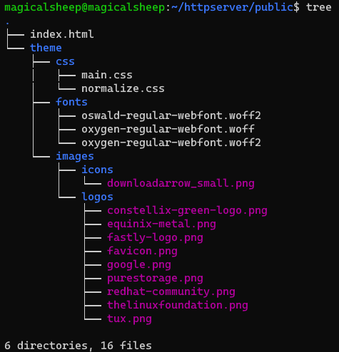
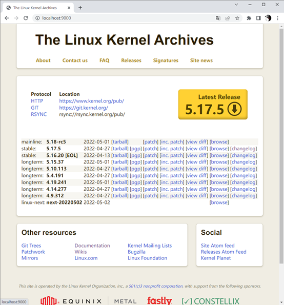
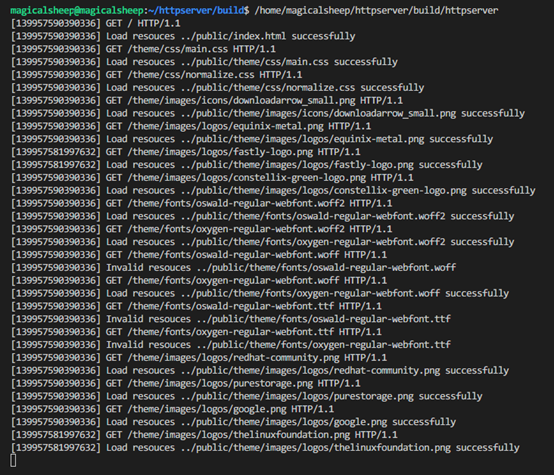

# HTTP 服务器

## 实验方案设计与实施

一个仅支持GET方法请求静态文件的HTTP服务器可以被分为两个主要组成部分：监听并处理请求、读取并返回文件。

监听并处理请求部分与代理服务程序几乎一致，我们仍然采用BIO模型，主线程循环监听客户端请求，新的TCP连接到达后创建新的Socket套接字，传递至工作线程中进行处理。与代理服务程序不同，正常请求文件的HTTP报文头部路径是一个相对于网站根目录的相对路径，对该路径的处理仅需要将其与网站的根目录进行拼接，得到绝对路径（或相对于HTTP服务程序工作路径的相对路径）。根据实验要求，其他的头部参数可被忽略考虑。因此，这部分的处理代码如下所示。

```c
// build real path
char real_path[100], rbuf[MAX_BUF], res[MAX_BUF << 1];
if (strncmp("/", path + path_len - 1, 1) == 0)
    sprintf(real_path, "%s%.*s%s", root, (int)path_len, path, default_page);
else
    sprintf(real_path, "%s%.*s", root, (int)path_len, path);
```

在完成绝对路径的构建之后，首先需要进行的对该路径的有效性及权限检查，当文件不存在或HTTP服务程序没有权限访问时，返回404或502错误。这部分代码通过调用系统函数实现，如下所示。

```c
// check file exist
if (access(real_path, F_OK) == -1)
{
    send(fd, NOT_FOUND_HEADER, strlen(NOT_FOUND_HEADER), 0);
    close(fd);
    printf("[%ld] Invalid resouces %s\n", pthread_self(), real_path);
    pthread_exit("File not found");
}
// check file permission
if (access(real_path, R_OK) == -1)
{
    send(fd, FORBIDDEN_HEADER, strlen(FORBIDDEN_HEADER), 0);
    close(fd);
    printf("[%ld] Permission denied for resources %s\n", pthread_self(), real_path);
    pthread_exit("Permission denied");
}
```

一旦检查通过，便可以开始读取文件内容，然后构建一个HTTP回复报文头，将文件内容附加在其之后，通过套接字返回客户端即可。需要注意的是，文件内容并不一定是文本内容，因此在使用拷贝函数复制文件内容的过程时，必须使用memcpy函数准确地复制字节流。同时，在回复报文头部中，需要增加文件内容大小及内容类型字段，以指示浏览器正确的解析返回内容。

## 实验结果展示与分析

网站根目录设为程序工作路径上一级的public文件夹中，这里使用Linux内核网站kernel.org的文件作为网站内容，其结构如下图所示。


 
运行HTTP服务程序，监听本地9000端口，通过浏览器访问显示如下。


 
HTTP服务程序显示如下。
 
