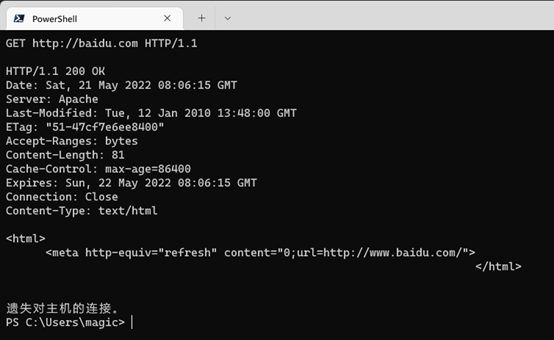
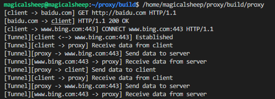

# HTTP 代理程序

## 实验方案设计与实施

### 基本要求

代理服务器通过解析客户端的HTTP请求获得目的地址及请求报文，重新组装新的报文后向目的服务器请求数据。因此，代理程序可简单的分为三部分内容：监听客户请求、解析与组装新报文、请求数据。
监听客户请求部分我们选择采用经典的BIO模型，由一个主线程循环监听特定端口的TCP连接，当产生新连接时，将会为该连接产生一个新的Socket套接字，这个套接字实体将作为参数被传递到新的线程中进行后续代理服务的处理，而主线程则继续阻塞监听新的TCP连接。这部分实现较为简单，具体代码如下。

```c
boss_fd = socket(AF_INET, SOCK_STREAM, 0);
if (boss_fd == -1)
    goto error;
struct sockaddr_in server_addr;
server_addr.sin_family = AF_INET;
server_addr.sin_addr.s_addr = htonl(INADDR_ANY);
server_addr.sin_port = htons(PORT);
if (bind(boss_fd, (struct sockaddr *)&server_addr, sizeof(server_addr)) == -1)
    goto error;
if (listen(boss_fd, MAX_CONNECTIONS) == -1)
    goto error;
while (1)
{
    int fd = accept(boss_fd, (struct sockaddr *)NULL, NULL);
    if (fd == -1)
        goto error;
    pthread_t pid;
    if (pthread_create(&pid, NULL, work, (void *)(&fd)) != 0)
        goto error;
    pthread_detach(pid);
}
```

解析与组装报文是该代理程序的处理核心。由于在代理模式下，从客户端发出的请求路径是一个绝对路径地址，因此对于解析步骤而言，最重要的一步就是将这一绝对路径地址划分为目的服务器地址与请求文件的相对目录两个字段。另外，请求头还可能携带如Cookie等有效的信息，这些信息也应当同样被传递至目的服务器。

在本程序中，使用了一个[开源的简单请求头解析器](https://github.com/h2o/picohttpparser)来完成原始HTTP请求的解析。它在吃入字符流的同时进行请求头解析，并提供一个相当精简的调用接口与返回结构。因此，读入请求并完成解析的代码如下所示。

```c
while (1)
{
    while ((rret = read(fd, buf + buflen, sizeof(buf) - buflen)) == -1 && errno == EINTR)
        ;
    if (rret <= 0)
        fail_back(fd, "Read error", &req);
    prevbuflen = buflen;
    buflen += rret;
    header_cnt = sizeof(headers) / sizeof(headers[0]);
    pret = phr_parse_request(buf, buflen, &method, &method_len, &path, &path_len, &minor_version, headers, &header_cnt, prevbuflen);
    if (pret > 0)
        break;
    else if (pret == -1)
        fail_back(fd, "Parse error", &req);
    if (buflen == sizeof(buf))
        fail_back(fd, "Request is too long", &req);
}
```

经过解析后，path指针将指向请求中的路径，method指针将指向请求方法，headers数组将由请求头中的键值对组成。通过对请求路径的字符串处理，最终我们将得到相对文件路径与目的服务器地址。

目的服务器地址并不总是IP地址，大多数情况下，它是一个域名，而创建一个Socket套接字需要使用目标主机的确切IP地址。因此，在获得目的服务器地址之后，我们还需要进行一次DNS查询。调用系统函数执行DNS查询获得IP地址的代码是比较简单的，如下所示。

```c
struct addrinfo hints, *res;
memset(&hints, 0, sizeof(hints));
hints.ai_family = AF_INET;
hints.ai_socktype = SOCK_STREAM;
if (getaddrinfo(s, "http", &hints, &res) != 0)
    return -1;
struct sockaddr_in *ip = (struct sockaddr_in *)res->ai_addr;
req->dest.sin_addr = ip->sin_addr;
freeaddrinfo(res);
```

最后，将请求方法、相对文件路径、HTTP版本、原始请求头结合起来，即可组装成为新的HTTP请求报文。在解析得到的目的服务器IP地址和指定端口上建立Socket套接字，通过该套接字将请求报文发送出去，便完成了代理。从远端服务器返回的HTTP Response并不需要代理服务器进行解析，因此，仅需要将字节流原封不动地通过客户端套接字返回即可。

### 隧道代理

由上文可知，完成HTTP代理依赖于解析来自客户端的请求报文，这意味着请求报文对于代理服务器而言必须完全透明。另一方面，在基于报文完全透明的情境下，代理服务器具备任意篡改请求的能力。因此，如果为了安全考虑而将HTTP报文进行加密，且代理服务器无法进行解密，则上述代理过程将完全失效。不幸的是，在HTTPS普及的今天，这样的问题相当严重。

于是我们为代理程序引入隧道代理功能，即打开一个客户端与目的服务器之间的通路，来自客户端的二进制数据流将原封不动地发向目的服务器，代理服务器将不再需要对请求报文进行解析。在实际应用中，客户端通过向代理服务器发送CONNECT报文请求打开隧道，因此，在进行传统HTTP代理之前，使用如下代码进行判断，将CONNECT请求导入隧道处理流程。

```c
if (req.method == CONNECT_METHOD)
{
    tunnel(fd, &req);
    goto end;
}
```

而按照基本原理实现一个隧道代理是简单的：打开一个与目标服务器的Socket套接字，双向地循环传递数据，代码如下所示。

```c
while (1)
{
    if ((rret = recv(fd, buf, HEAP_BUF_SIZE, 0)) <= 0)
        break;
    if (send(tun, buf, rret, 0) <= 0)
        break;
    if ((rret = recv(tun, buf, HEAP_BUF_SIZE, 0)) <= 0)
        break;
    if (send(fd, buf, rret, 0) <= 0)
        break;
}
```

然而经过我的实践发现，这种简单的裸Socket代码并不能解决在系统层面启用代理后所面临的高并发问题，大多数情况下，在完成HTTPS证书交换后，代理程序就几乎陷入瘫痪了。在面临高并发的环境下，BIO以及非零拷贝的处理几乎无法正常工作。但总而言之，这种实验还是极其具有学习意义的。

## 实验结果展示与分析

基本HTTP代理结果如下图所示。


 
代理程序显示内容及隧道代理运行结果如下图所示。

